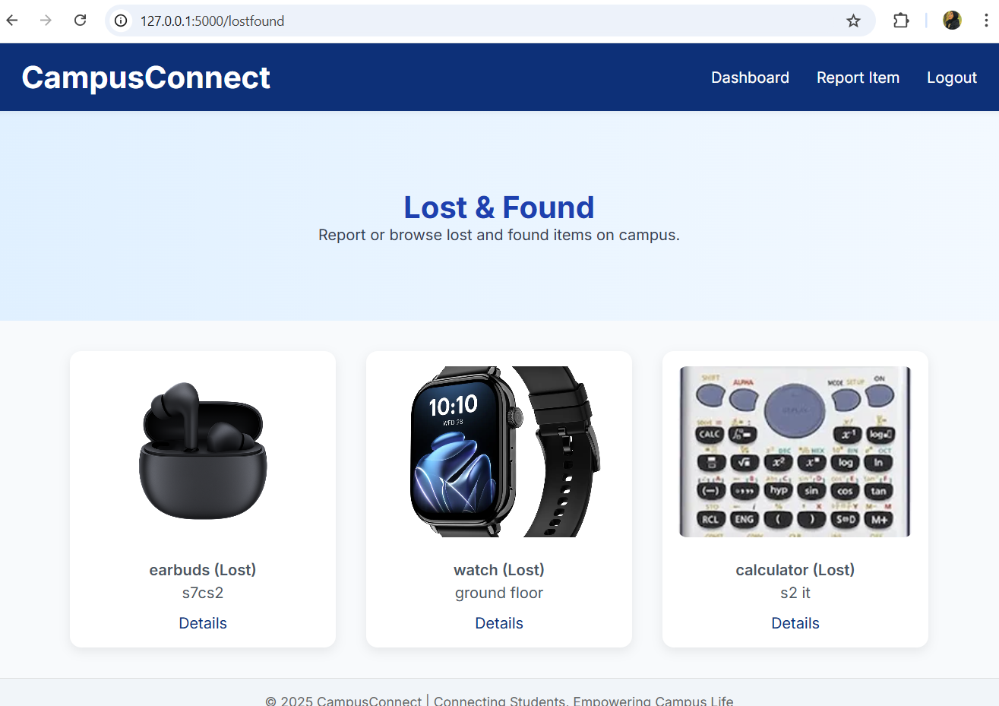
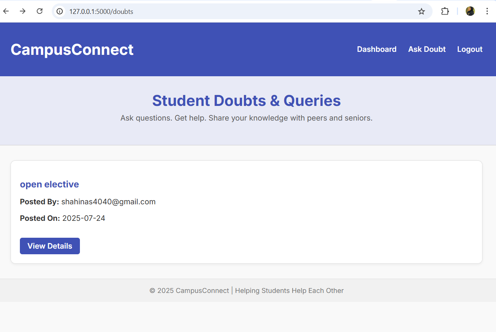

# 🏫 CampusConnect

**CampusConnect** is an all-in-one web platform designed exclusively for college students to manage their campus life more efficiently. It offers utilities such as a marketplace, lost & found system, event sharing, and a public doubt discussion board — all within a single application.

---

## 🚀 Features

- 🎓 **Doubts Section**  
  Post and discuss academic or general doubts publicly with fellow students.

- 📢 **Events**  
  Share, explore, and keep track of campus events like fests, workshops, and talks.

- 🛍️ **Marketplace**  
  Buy and sell used books, gadgets, and stationery items securely within the campus.

- 🔍 **Lost & Found**  
  Report or search for lost items found on campus.

---

## 🛠️ Tech Stack

- **Frontend**: HTML, CSS, JavaScript (Jinja2 templating)
- **Backend**: Flask (Python)
- **Database**: PostgreSQL
- **Others**: SQLAlchemy, WTForms

---

## 📸 Screenshots

> Screenshots of the core features and pages:

| Page           | Preview |
|----------------|---------|
| Landing        |  |
| Marketplace    |  |
| Lost & Found   |  |
| Events         |  |
| Doubts         |  |
| Doubt Detail   |  |

---

## 📦 Setup Instructions

1. **Clone the repository**
   ```bash
   git clone https://github.com/your-username/CampusConnect.git
   cd CampusConnect
