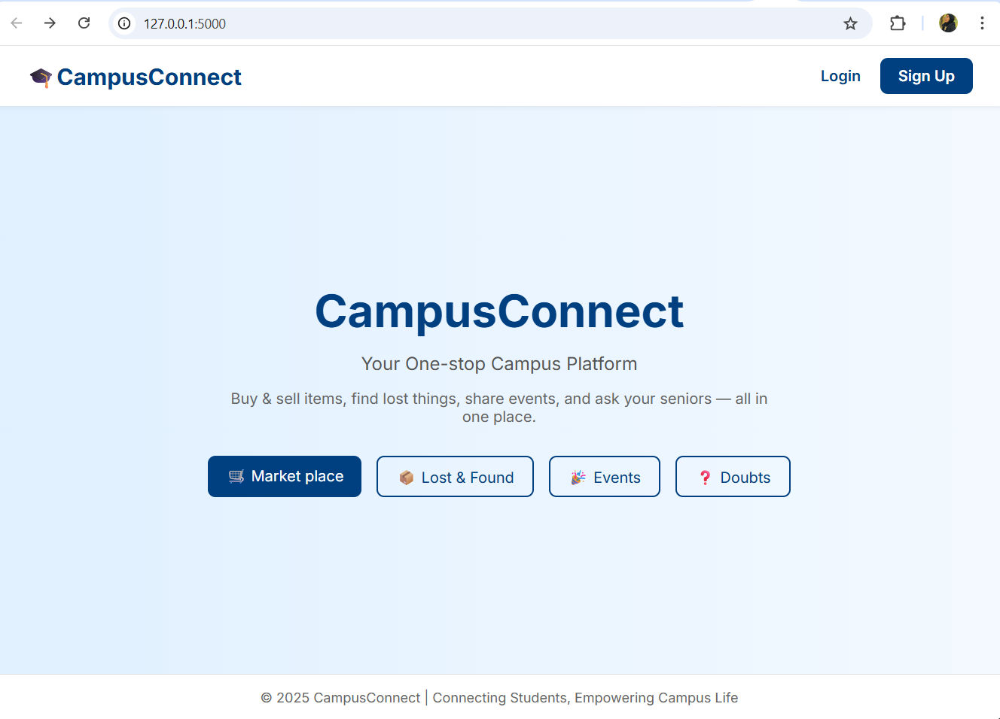
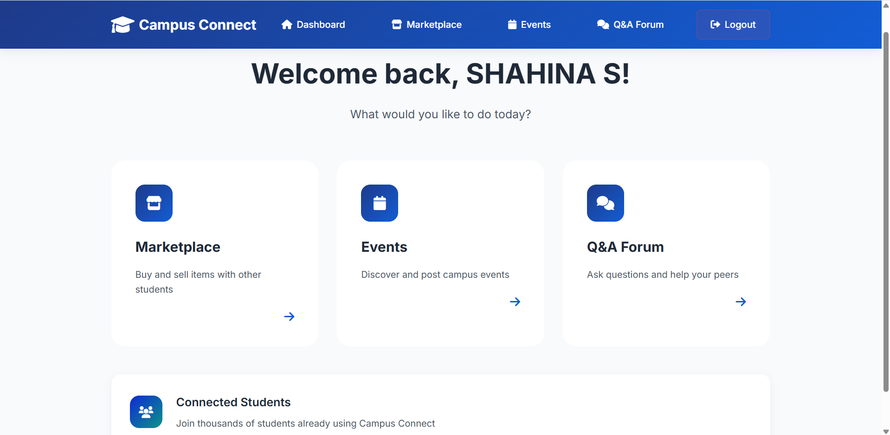
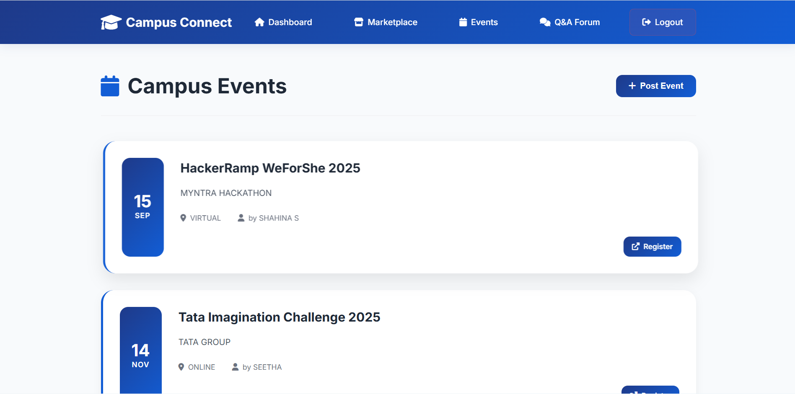
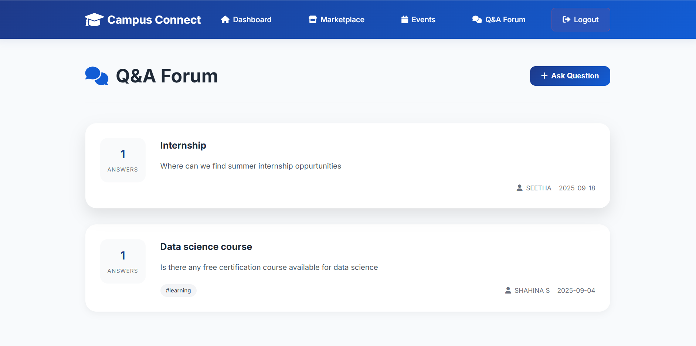

# 🌐 Campus Connect

Campus Connect is an **all-in-one platform for campus life** where students can:  
- Buy and sell items in a secure **Marketplace**  
- Discover and register for **Events**  
- Engage in discussions through a **Forum**  

This project aims to simplify student life by providing a single platform for collaboration, sharing, and discovery.

---

## 🚀 Features
- 🔑 **Authentication** – Secure login & signup system  
- 🛒 **Marketplace** – Buy/sell items safely with fellow students  
- 📅 **Events** – Explore campus events and register easily  
- 💬 **Forum** – Ask questions, share knowledge, and connect with peers  
- 📊 **Dashboard** – Personalized space to manage activities  

---

## 🛠️ Tech Stack
- **Frontend:** HTML, CSS, JavaScript  
- **Backend:** Flask (Python)  
- **Database:** SQLite  
  

---

## 📸 Screenshots

### Landing Page


### Home


### Marketplace


### Events


### Q&A


### Q&A - Answers


---

## ⚙️ Installation & Setup

### Clone the repository
```bash
git clone https://github.com/shahinasalimm/CampusConnect.git
cd CampusConnect
Create a virtual environment
bash
python -m venv venv
venv\Scripts\activate   # On Windows
source venv/bin/activate   # On macOS/Linux
Install dependencies
bash
pip install -r requirements.txt
Run the application
bash
python app.py

